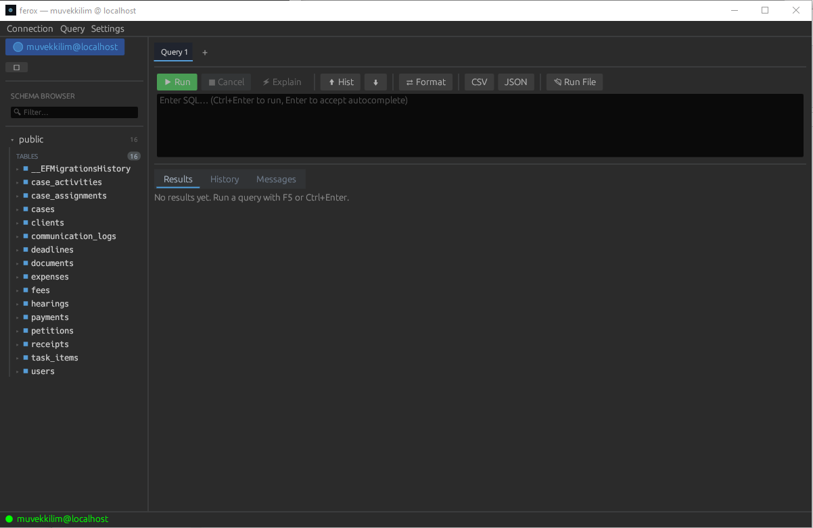
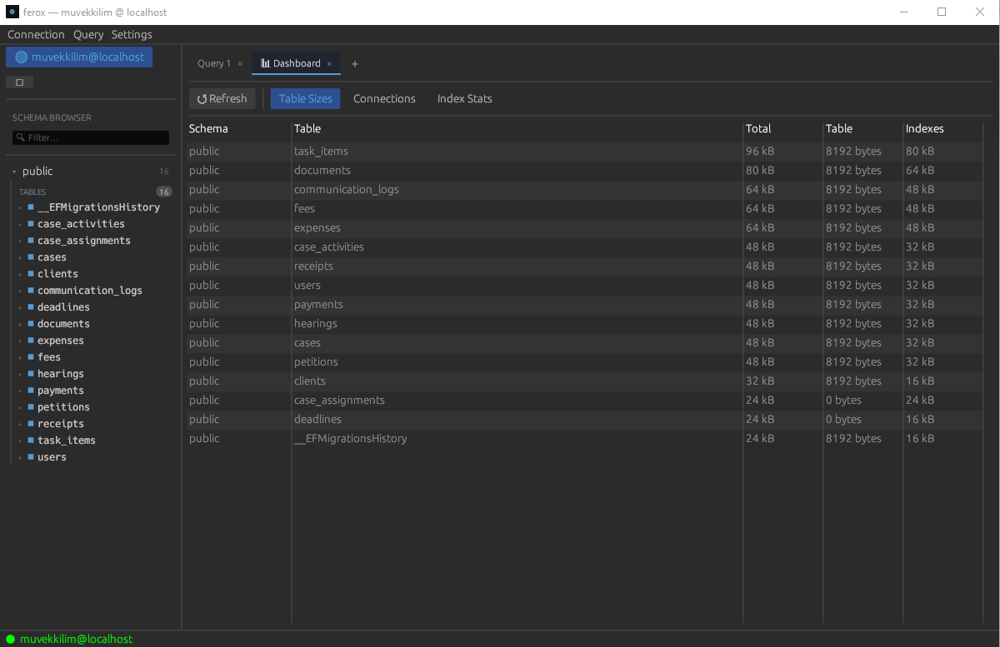
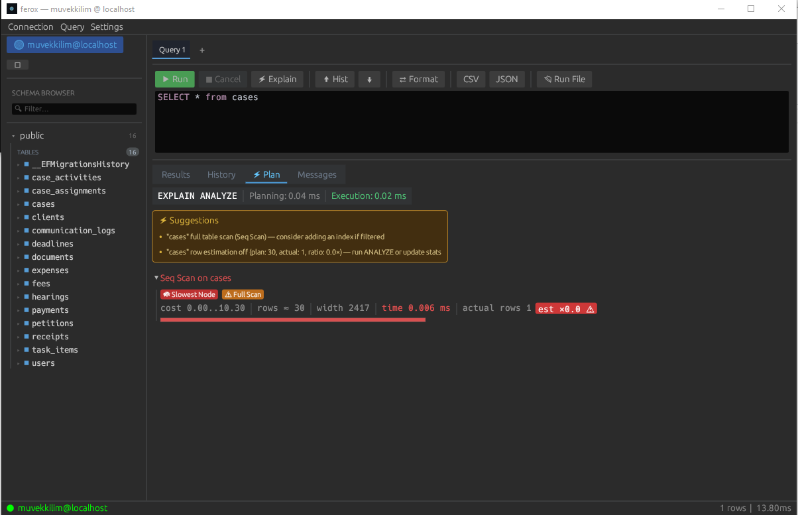
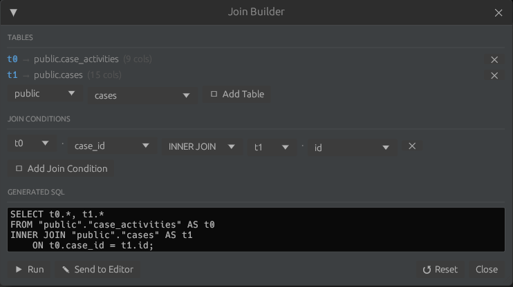
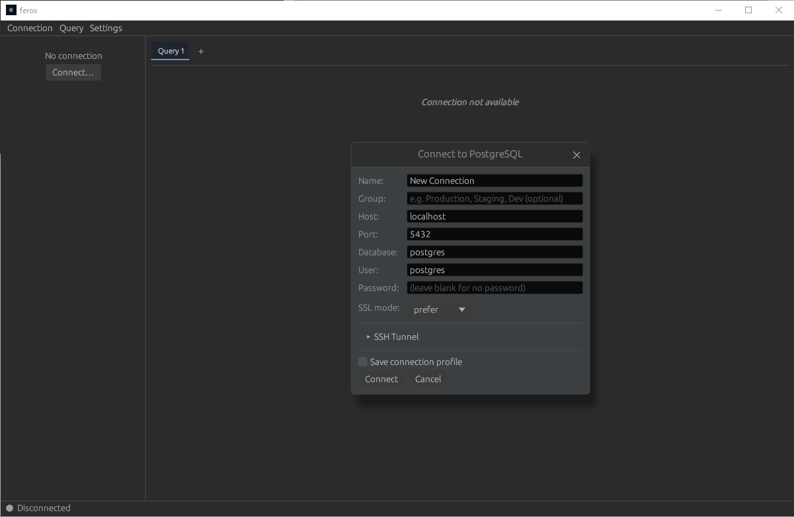

<div align="center">

```
███████╗███████╗██████╗  ██████╗ ██╗  ██╗
██╔════╝██╔════╝██╔══██╗██╔═══██╗╚██╗██╔╝
█████╗  █████╗  ██████╔╝██║   ██║ ╚███╔╝
██╔══╝  ██╔══╝  ██╔══██╗██║   ██║ ██╔██╗
██║     ███████╗██║  ██║╚██████╔╝██╔╝ ██╗
╚═╝     ╚══════╝╚═╝  ╚═╝ ╚═════╝ ╚═╝  ╚═╝
```

**A blazing-fast PostgreSQL client built in Rust.**
*No Electron. No JVM. No bloat.*

[](https://github.com/frkdrgt/ferox/actions)
[](https://github.com/frkdrgt/ferox/releases)
[](LICENSE)
[](https://www.rust-lang.org)

</div>

---

> **Ferox** runs under 50 MB and starts in under 200 ms — because your database client shouldn't be the bottleneck.

---

## Screenshots

| Main editor | Dashboard |
|:-----------:|:---------:|
|  |  |

| EXPLAIN ANALYZE | Join Builder |
|:---------------:|:------------:|
|  |  |

<div align="center">



*Settings → Language for EN/TR switch · Settings → About*

</div>

---

## Features

### ✨ AI — Natural Language to SQL

Press **`Ctrl+I`** (or the `AI` button in the toolbar) to open the NL bar. Type plain English — Ferox fetches the live schema from your DB and sends it to the AI, so the generated query always uses your real tables and columns.

```
"show me the top 10 customers by total order value in the last 30 days"
```

Ferox sends the full live schema as context — the AI sees every table, column, and type in the connected database. No hallucinated table names.

**Supported providers** (configure via `Settings → AI`):

| Provider | Notes |
|----------|-------|
| **Anthropic Claude** | `claude-haiku-4-5` by default — fast and cheap |
| **Groq** | `llama-3.3-70b-versatile` — free tier available |
| **Ollama** | Fully local, no API key, no data leaves your machine |
| **OpenAI** | `gpt-4o-mini` by default |
| **Custom / OpenRouter** | Any OpenAI-compatible endpoint via base URL override |

The generated SQL is placed directly in the active query editor — review it, tweak it, run it.

---

### Core
- **Multi-tab query editor** — Ctrl+T new tab, Ctrl+W close, right-click for Close / Close Others / Close All
- **Per-table tabs** — clicking a table opens it in its own tab; existing tabs are reused
- **Schema browser** — lazy-loaded tree: schemas → tables / views / mat-views / foreign tables, live filter
- **Data browser** — double-click any table or view to browse with server-side pagination & ORDER BY
- **Inline editing** — double-click a cell to edit, Enter to commit, Escape to cancel
- **Persistent query history** — last 500 queries, searchable, click to reload

### Query Tools
- **Multi-statement execution** — `;`-separated statements run in sequence; each SELECT result opens in its own tab
- **View DDL** — right-click any view or materialized view → Show DDL
- **EXPLAIN visualizer** — tree view of query plans with cost, rows, and timing per node; optimization suggestions
- **Safe mode transactions** — DML wrapped in explicit BEGIN/COMMIT/ROLLBACK
- **Export** — CSV & JSON via native OS file dialog (no temp files)
- **Script generation** — right-click table → Generate SELECT / INSERT / UPDATE / DELETE scripts
- **Join Builder** — visual multi-table JOIN composer (`Query → Join Builder…`)
- **Column statistics** — right-click any column header → null %, distinct count, min/max length, top values

### Developer Experience
- **SQL syntax highlighting** — zero-dependency tokenizer, dark (`base16-ocean.dark`) and light (`InspiredGitHub`) themes
- **SQL autocomplete** — table names, column names, keywords
- **Connection profiles** — saved to `~/.config/ferox/config.toml`; SSL modes + SSH tunnel supported
- **Multiple simultaneous connections** — per-connection sidebar, tabs, and DB threads
- **ER diagram** — visual schema relationship viewer with FK arrows, pan/zoom, draggable nodes
- **Database dashboard** — table sizes, index stats, active connections with kill support
- **F5 / Ctrl+Enter** to run, **Ctrl+C** to cancel mid-query
- **EN / TR localisation** — full bilingual UI; language choice persists to config

---

## Performance

| Metric | Ferox |
|--------|-------|
| RAM at idle | **~45 MB** |
| Cold startup | **< 200 ms** |
| Binary size | **~7 MB** |

*Measured on Windows 10, release build with LTO.*

---

## Installation

### Pre-built binaries

Download the latest release for your platform from the [Releases page](https://github.com/frkdrgt/ferox/releases).

| Platform | File |
|----------|------|
| Windows 10+ | `ferox-windows-x86_64.exe` |
| macOS 12+ (Intel + Apple Silicon) | `ferox-macos-universal` |
| Linux x86\_64 | `ferox-linux-x86_64` |

### macOS — first launch

macOS may block the binary with a "unidentified developer" warning because Ferox is not notarized. To allow it:

```bash
xattr -rd com.apple.quarantine /path/to/ferox-macos-universal
```

Then double-click (or `chmod +x` and run from terminal).

### Build from source

```bash
# Prerequisites: Rust 1.75+ (https://rustup.rs)
git clone https://github.com/frkdrgt/ferox.git
cd ferox
cargo build --release
```

Binary lands at `target/release/ferox` (or `ferox.exe` on Windows).

---

## Quick Start

1. Launch Ferox
2. **Connection → New Connection…** — enter host, port, user, password, database
3. Toggle SSL if needed (`prefer` works for most setups)
4. Hit **Connect** — schema tree loads on the left

### Running a query

Type SQL in the editor, press `F5` or `Ctrl+Enter`.

```sql
SELECT u.name, COUNT(o.id) AS orders
FROM users u
LEFT JOIN orders o ON u.id = o.user_id
GROUP BY u.name
ORDER BY orders DESC;
```

Or use the **Join Builder** (`Query → Join Builder…`) to construct joins visually.

### Keyboard shortcuts

| Shortcut | Action |
|----------|--------|
| `F5` / `Ctrl+Enter` | Run query |
| `Ctrl+C` | Cancel running query |
| `Ctrl+T` | New tab |
| `Ctrl+W` | Close tab |
| `Ctrl+Tab` | Next tab |
| `Ctrl+Shift+Tab` | Previous tab |
| `F5` (sidebar focused) | Refresh schema tree |

---

## Configuration

Profiles are stored automatically:

| Platform | Path |
|----------|------|
| Windows | `%APPDATA%\ferox\config.toml` |
| macOS / Linux | `~/.config/ferox/config.toml` |

```toml
[[connections]]
name     = "prod-readonly"
host     = "db.example.com"
port     = 5432
user     = "analyst"
password = ""        # leave empty to prompt
database = "warehouse"
ssl      = "require"

[language]          # "en" or "tr"
language = "en"
```

Query history lives at `~/.local/share/ferox/history.txt` (max 500 entries).

---

## Architecture

Ferox uses three dedicated threads, zero shared mutable state between them:

```
┌──────────────────────────────────────────────────────────┐
│                  UI Thread (eframe)                      │
│   egui immediate-mode rendering                          │
│   sidebar · tabs · join builder · NL bar                 │
└────────┬───────────┬──────────────┬───────────┬──────────┘
         │ DbCommand │ DbEvent      │ AiCommand │ AiEvent
         ▼           ▼              ▼           ▼
┌────────────────────┐   ┌─────────────────────────────────┐
│   DB Thread        │   │        AI Thread (tokio)        │
│   (tokio)          │   │  reqwest · Anthropic / OpenAI   │
│   tokio-postgres   │   │  Groq · Ollama · custom         │
│   native-tls       │   │  Schema context fetched live    │
│   async queries    │   │  from DB before every request   │
└────────────────────┘   └─────────────────────────────────┘
```

All communication goes through `mpsc` channels — the UI thread never blocks.

---

## Tech Stack

| Role | Crate |
|------|-------|
| GUI framework | [`egui`](https://github.com/emilk/egui) + `eframe` |
| Table widget | `egui_extras` |
| PostgreSQL driver | [`tokio-postgres`](https://github.com/sfackler/rust-postgres) |
| Async runtime | `tokio` (current-thread per worker thread) |
| TLS | `native-tls` + `postgres-native-tls` |
| SSH tunnel | `russh` |
| AI HTTP client | `reqwest` (native-tls, JSON) |
| SQL highlighting | custom zero-dependency tokenizer (`src/ui/syntax.rs`) |
| Config | `serde` + `toml` |
| File dialogs | [`rfd`](https://github.com/PolyMeilex/rfd) |

---

## Roadmap

- [x] **Auto-complete** — table names, column names, SQL keywords
- [x] **Database dashboard** — table sizes, index bloat, active connections
- [x] **Multiple simultaneous connections** — separate DB threads per connection
- [x] **SSH tunnel** — connect through a jump host
- [x] **ER diagram** — visual schema relationships
- [x] **Multi-statement queries** — run multiple statements separated by `;`
- [x] **View DDL** — right-click any view or materialized view to see its definition
- [x] **Safe mode transactions** — explicit BEGIN/COMMIT/ROLLBACK for DML
- [x] **Join Builder** — visual multi-table JOIN composer
- [x] **EN/TR localisation** — full bilingual UI, language persists to config
- [x] **Settings & About** — Settings menu with language switcher and About dialog
- [x] **Test Connection** — verify credentials before connecting, from the connection dialog
- [x] **Close connection** — disconnect and remove a connection from the sidebar with one click
- [x] **Connection status indicators** — color-coded dots replacing broken emoji squares on Windows
- [x] **AI: Natural Language → SQL** — multi-provider (Claude, Groq, Ollama, OpenAI, custom), live schema context
- [ ] **Ctrl+A** select-all in query editor
- [ ] **Bookmarked queries** — save & name frequently used SQL
- [ ] **Dark / light theme toggle** — runtime switch
- [ ] **Result diff** — compare two query results side-by-side
- [ ] **CSV / JSON import** — drag-and-drop data into a table

---

## Contributing

Bug reports, feature requests, and pull requests are welcome.

```bash
# Run against a local Postgres
docker run -d -p 5432:5432 -e POSTGRES_PASSWORD=test postgres:16

# Dev build (faster compile, debug symbols)
cargo build

# Integration tests (requires Postgres on localhost:5432)
cargo test --test integration
```

Please keep the UI thread non-blocking and all DB work behind `DbCommand` / `DbEvent`.
See `CLAUDE.md` for architecture notes.

---

## How This Was Built

This project is an experiment in **vibe-coding** — writing software primarily through conversation with an AI, rather than typing code by hand.

Every line of Rust in this repository was generated by [Claude](https://claude.ai) (Anthropic) via [Claude Code](https://github.com/anthropics/claude-code). Every commit was authored through an AI session. The developer's role was to define what to build, review what came out, and decide what to do next — not to write the code itself.

### Why be upfront about this?

Because it matters. If you're evaluating this project — as a tool, as a reference, or as a hiring signal — you deserve to know how it was made. Passing this off as hand-crafted Rust would be dishonest.

### What the human actually did

- Chose the goal: a lightweight, native PostgreSQL client as an alternative to DBeaver/DataGrip
- Picked the stack: `egui`, `tokio-postgres`, `russh` — no Electron, no JVM
- Defined the architecture: two-thread model, `mpsc` channels, no shared mutable state between UI and DB
- Wrote the `CLAUDE.md` spec that guided every session
- Planned each feature phase, reviewed diffs, caught bugs, and made judgment calls
- Did *not* write the actual Rust

### What Claude actually did

- Wrote all source files from scratch (`src/app.rs`, `src/db/`, `src/ui/`, etc.)
- Made architectural decisions within the constraints given
- Debugged compile errors iteratively
- Kept the codebase consistent across sessions using the `CLAUDE.md` context

### Is the code good?

Honestly: mostly yes, sometimes no. The architecture is clean and the UI thread never blocks. There are places where a seasoned Rust developer would've made different tradeoffs — but it compiles, it runs, and it does what it's supposed to do. It started from zero and grew to a multi-feature desktop app across a handful of sessions.

### The point

This isn't about whether AI-generated code is "real" code. It's about what's now possible when you pair a clear technical vision with a capable AI. Ferox exists because it was cheap enough — in time and effort — to just build the thing.

Whether that's exciting or unsettling probably says something about where you are in your relationship with these tools.

---

## License

MIT — see [LICENSE](LICENSE)

---

<div align="center">

*Built with Rust because life's too short for slow database clients.*
*Written by Claude because that's just where we are now.*

</div>
